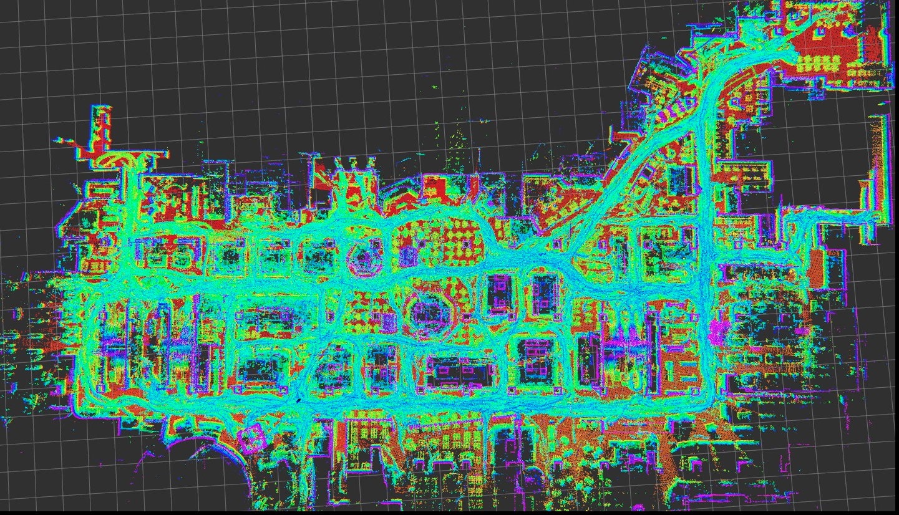
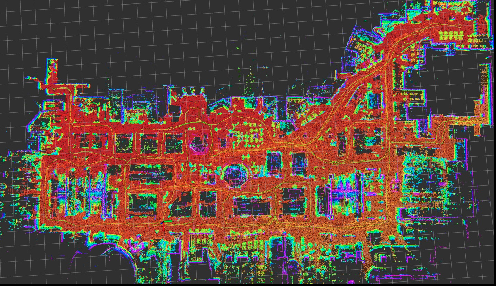

# NaverLabs Indoor - LiDAR dataset API

* These dataset are obtained in realistic department store environments!

[[**Paper**]](https://openaccess.thecvf.com/content/CVPR2021/html/Lee_Large-Scale_Localization_Datasets_in_Crowded_Indoor_Spaces_CVPR_2021_paper.html) [[**Video**]](https://www.youtube.com/watch?v=7D08fWAlqzY)


(This demo video is the case when mode is `both`. Please refer to below instructions)

## Descrptions

* Complex Indoor environments
* Hundreds of dynamic objects, i.e. humans
* For detailed explanations, please refer to [NAVER LABS](https://europe.naverlabs.com/blog/first-of-a-kind-large-scale-localization-datasets-in-crowded-indoor-spaces/) website
* Data can be downloaded [here](https://www.naverlabs.com/en/datasets/requestDataset).
    * Unfortunately, as far as I know, HD Map & Localization Dataset request is available only to **Korean researchers and organizations**... :sob: . 

## Data format
```
data_path (`/nvlabs/abs_dir` in `launch/lidar_publisher.launch` file)
_____images
     |...
_____pointclouds_data
     |...
_____camera_parameters.txt
_____groundtruth.hdf5
_____map.pcd
```

It's complex but you can just load poses and the corresponding lidar data as follows:

```cpp
/***
* How to load the i-th point cloud
*/
pcl::PointCloud<PointType>::Ptr srcCloud(new pcl::PointCloud<PointType>);
*srcCloud = *loader.cloud(i);

/***
* How to load the i-th pose
*/
Eigen::Matrix4f pose = loader.pose(i);
```

Please refer to `src/data_publisher.cpp`.
## How to Run

```
$ catkin build naverlabs_api
$ roslaunch naverlabs_api lidar_publisher.launch
```

Note that **you can choose the lidar type among three modes**, i.e. `lidar0`, `lidar1`, and `both`.

## Applications

You can erase traces of dynamic objects by [ERASOR](https://github.com/LimHyungTae/ERASOR).

(The below cyan points denote the traces by humans!)

Before the application                  |  After the application
:-------------------------:|:-------------------------:
 |  


